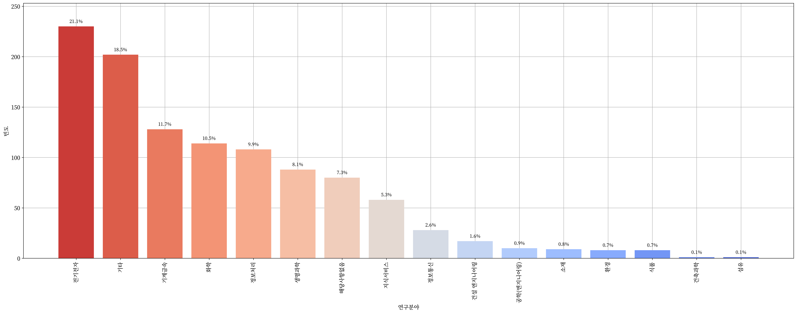
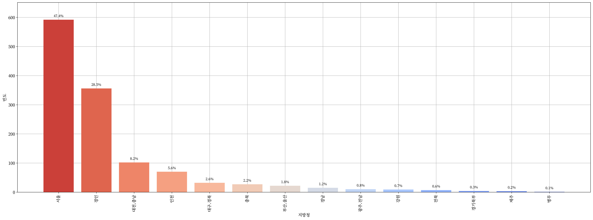
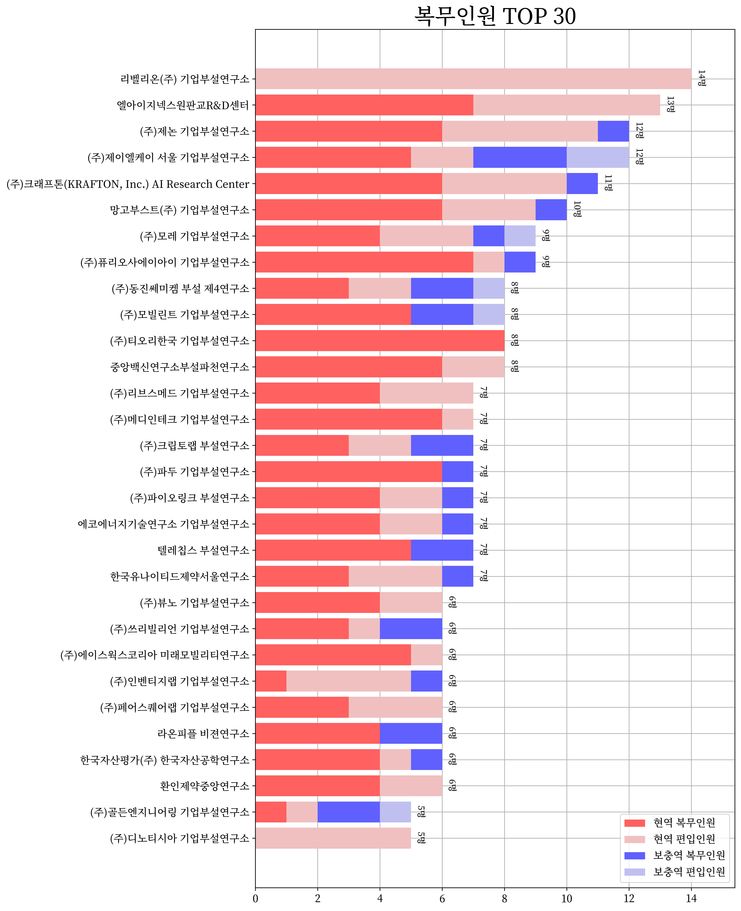
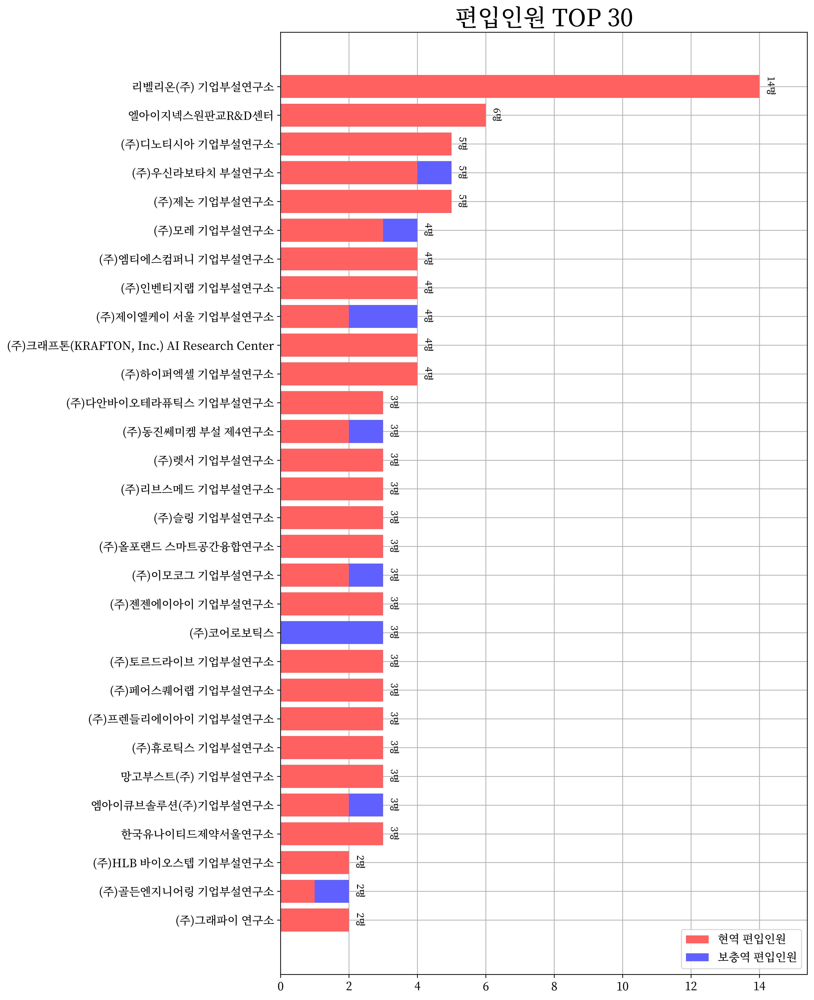
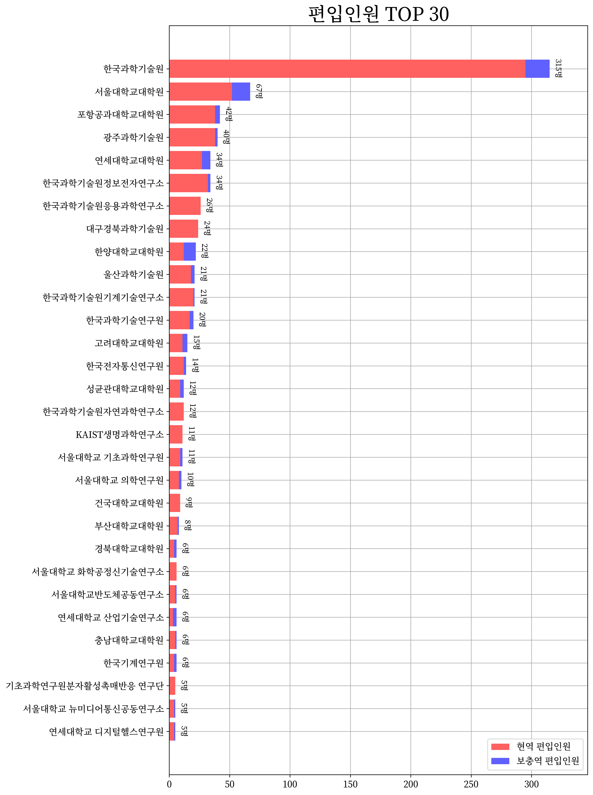
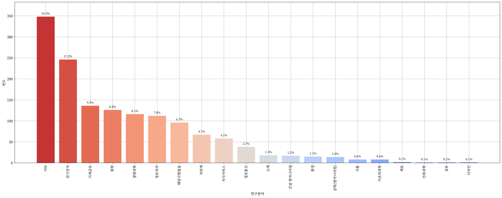
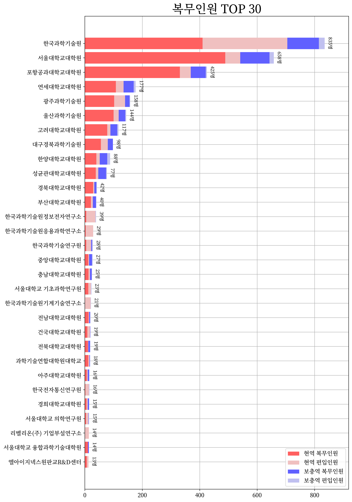
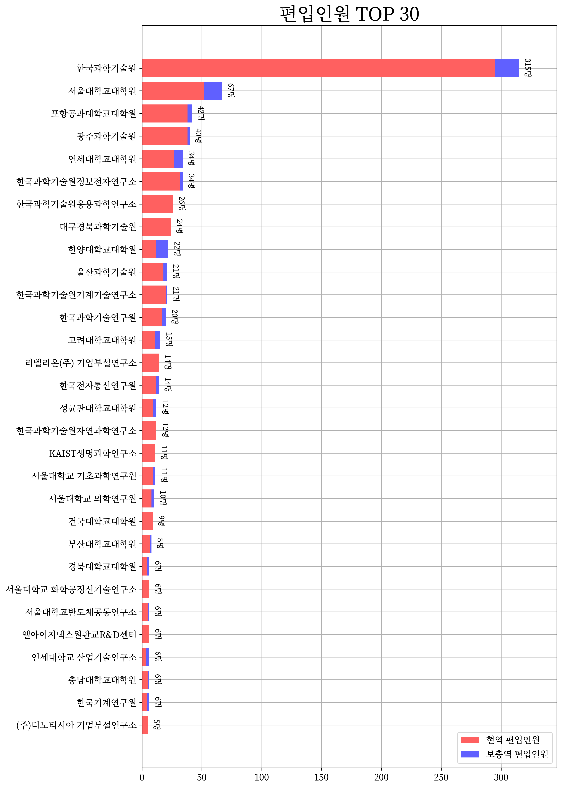

 <h1> 🧑‍💻 전문연구요원을 위한 데이터 적재 및 시각화 🧑‍💻 </h1> 

  
   
  
   
  

 

> [**「병역법 제2조제16항」**](https://www.law.go.kr/%EB%B2%95%EB%A0%B9/%EB%B3%91%EC%97%AD%EB%B2%95/%EC%A0%9C2%EC%A1%B0) “전문연구요원”이란 학문과 기술의 연구를 위하여 제36조에 따라 전문연구요원(專門硏究要員)으로 편입되어 해당 전문 분야의 연구업무에 복무하는 사람을 말한다.

> [**「병역법 제3조제1항」**](https://www.law.go.kr/%EB%B2%95%EB%A0%B9/%EB%B3%91%EC%97%AD%EB%B2%95/%EC%A0%9C3%EC%A1%B0) 대한민국 국민인 남성은 헌법과 이 법에서 정하는 바에 따라 병역의무를 성실히 수행하여야 한다.

  <h2> 🎒 석사 전문연구요원 🎒 </h2>

  

    
    
    
    
    
     
    <a href="prop/MS/README.md"> 📝 표로 보기 📝 </a>
  

  <h2> 🎓 박사 전문연구요원 🎓 </h2>

  

    
    
    
    
    
     
    <a href="prop/PhD/README.md"> 📝 표로 보기 📝 </a>
  

  <h2> 💡 전체 전문연구요원 💡 </h2>

  

    
    
    
    
    
    
     
    <a href="prop/ALL/README.md"> 📝 표로 보기 📝 </a>
  

---

 <h1> 📝 전문연구요원 블로그 📝 </h1> 

+ [Zerohertz](https://zerohertz.github.io/tags/%EC%A0%84%EB%AC%B8%EC%97%B0%EA%B5%AC%EC%9A%94%EC%9B%90/)
+ [harryp](https://harryp.tistory.com/category/Park%27s%20Life/%EC%A0%84%EB%AC%B8%EC%97%B0%EA%B5%AC%EC%9A%94%EC%9B%90)
+ [remocon33](https://remocon33.tistory.com/m/category/%EC%A0%84%EB%AC%B8%EC%97%B0%EA%B5%AC%EC%9A%94%EC%9B%90)
+ [cv-learn](https://www.cv-learn.com/tags/%EC%A0%84%EB%AC%B8%EC%97%B0%EA%B5%AC%EC%9A%94%EC%9B%90/)
+ [jeongmincha](https://jeongmincha.github.io/tags/%EC%A0%84%EB%AC%B8%EC%97%B0%EA%B5%AC%EC%9A%94%EC%9B%90/)
+ [queez0405](https://queez0405.github.io/tags/#%EC%A0%84%EB%AC%B8%EC%97%B0%EA%B5%AC%EC%9A%94%EC%9B%90)
+ [thinkpro](https://thinkpro.tistory.com/tag/%EC%A0%84%EB%AC%B8%EC%97%B0%EA%B5%AC%EC%9A%94%EC%9B%90)
+ [next-brain](https://next-brain.tistory.com/tag/%EC%A0%84%EB%AC%B8%EC%97%B0%EA%B5%AC%EC%9A%94%EC%9B%90)

---

> [!NOTE]
> See also [awesome-sgy](https://github.com/Zerohertz/awesome-sgy)
