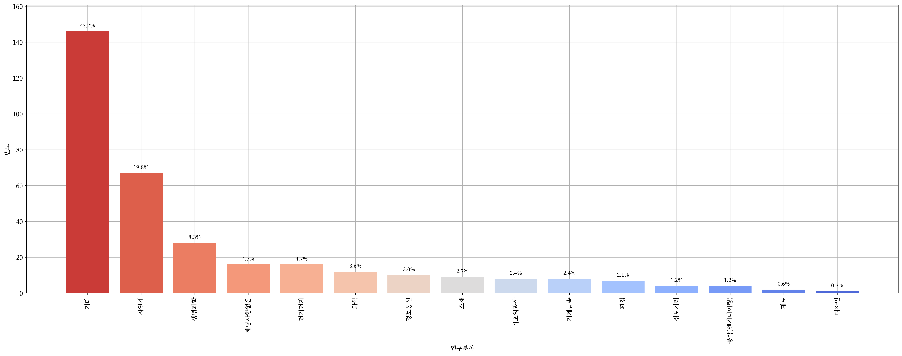
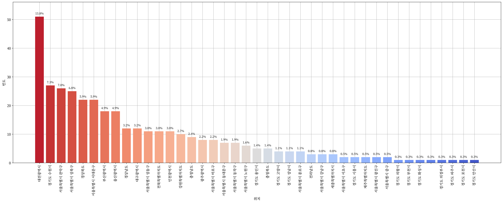

 <h1> :technologist: 전문연구요원을 위한 데이터 적재 및 시각화 :technologist: </h1> 

  
   
  

 

> [**「병역법 제2조 제16항」**](https://www.law.go.kr/%EB%B2%95%EB%A0%B9/%EB%B3%91%EC%97%AD%EB%B2%95/%EC%A0%9C2%EC%A1%B0) “전문연구요원”이란 학문과 기술의 연구를 위하여 제36조에 따라 전문연구요원(專門硏究要員)으로 편입되어 해당 전문 분야의 연구업무에 복무하는 사람을 말한다.

> [**「병역법 제3조 제1항」**](https://www.law.go.kr/%EB%B2%95%EB%A0%B9/%EB%B3%91%EC%97%AD%EB%B2%95/%EC%A0%9C3%EC%A1%B0) 대한민국 국민인 남성은 헌법과 이 법에서 정하는 바에 따라 병역의무를 성실히 수행하여야 한다.

  <h2> :school_satchel: 석사 전문연구요원 :school_satchel: </h2>

  

    
    
    
    
    
     
    <a href="https://github.com/Zerohertz/awesome-jmy/blob/main/prop/MS/README.md"> :pencil: 표로 보기 :pencil: </a>
  

  <h2> :mortar_board: 박사 전문연구요원 :mortar_board: </h2>

  

    
    
    
    
    
     
    <a href="https://github.com/Zerohertz/awesome-jmy/blob/main/prop/PhD/README.md"> :pencil: 표로 보기 :pencil: </a>
  

  <h2> :bulb: 전체 전문연구요원 :bulb: </h2>

  

    
    
    
    
    
    
     
    <a href="https://github.com/Zerohertz/awesome-jmy/blob/main/prop/ALL/README.md"> :pencil: 표로 보기 :pencil: </a>
  

---

 <h1> :memo: 전문연구요원 블로그 :memo: </h1> 

+ [Zerohertz](https://zerohertz.github.io/tags/%EC%A0%84%EB%AC%B8%EC%97%B0%EA%B5%AC%EC%9A%94%EC%9B%90/)
+ [cv-learn](https://www.cv-learn.com/tags/%EC%A0%84%EB%AC%B8%EC%97%B0%EA%B5%AC%EC%9A%94%EC%9B%90/)
+ [conqrean](https://conqrean.tistory.com/tag/%EC%A0%84%EB%AC%B8%EC%97%B0%EA%B5%AC%EC%9A%94%EC%9B%90)
