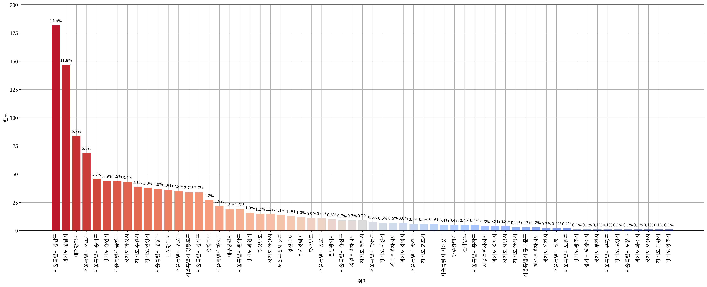

 <h1> :technologist: 전문연구요원을 위한 데이터 적재 및 시각화 :technologist: </h1> 

  
   
  

  <h2> :school_satchel: 석사 전문연구요원 :school_satchel: </h2>

  

    
    
    
    
    
     
    <a href="https://github.com/Zerohertz/awesome-jmy/blob/main/prop/MS/README.md"> :pencil: 표로 보기 :pencil: </a>
  

  <h2> :mortar_board: 박사 전문연구요원 :mortar_board: </h2>

  

    
    
    
    
    
     
    <a href="https://github.com/Zerohertz/awesome-jmy/blob/main/prop/PhD/README.md"> :pencil: 표로 보기 :pencil: </a>
  

  <h2> :bulb: 전체 전문연구요원 :bulb: </h2>

  

    
    
    
    
    
    
     
    <a href="https://github.com/Zerohertz/awesome-jmy/blob/main/prop/ALL/README.md"> :pencil: 표로 보기 :pencil: </a>
  

